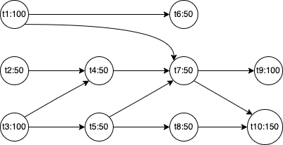

# wrake
一个微型的方法并行调用编排框架

## 1.解决什么问题

简化已有任务编排API的编写风格

## 2.如何使用

## 3.基本原理

wRake，采用Reactor的工作模式，使用主线程进行任务编排，线程池充当wokers，在线程池执行任务时，主线程通过LockSupport.park进行等待阻塞。当工作线程执行完毕之后，通过LockSuppor.unpark对主线程进行唤醒。

## 4.基准测试结果

## 5.使用及建议

以下几种情况，不建议使用该框架：

1. 若任务间存在大量先后依赖关系，此时不建议使用
2. 线程池资源紧张