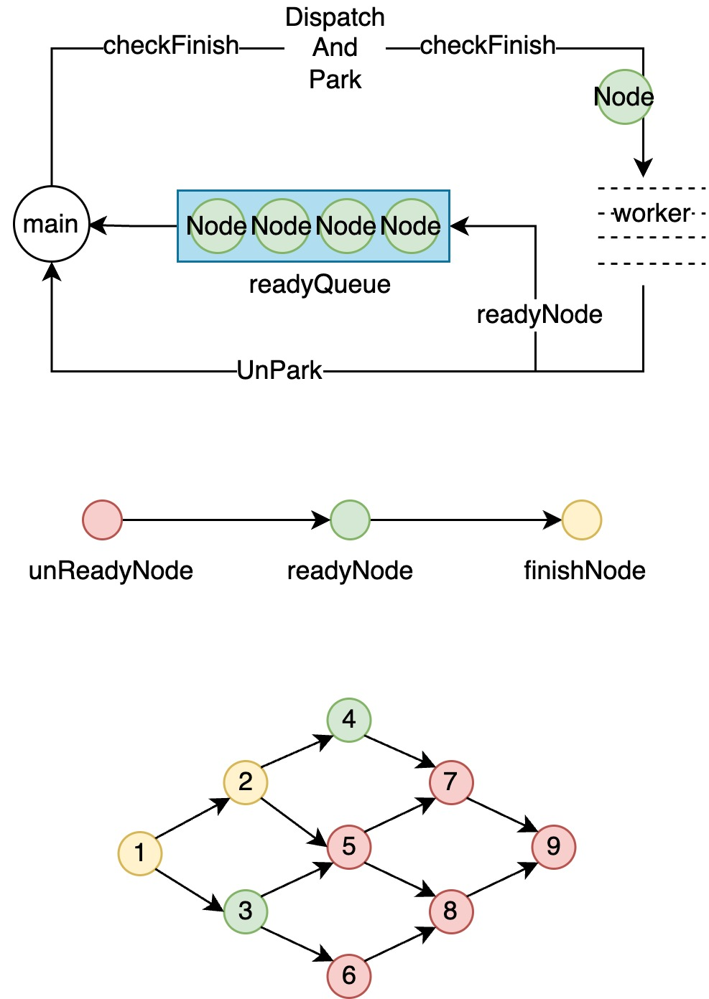

# wRake
wRake是一个微型的**方法并发调用编排**框架。

主要用于提升多依赖调用并发度，从而提升接口性能。

用户可通过`defDepends`定义任务依赖，在执行过程中，当一个任务的前置任务都执行完毕，该任务会进入readyQueue，进行调用节点编排，采用Reactor模型进行扫描+分发。

与CompletableFuture相比，提供了更为复杂依赖任务编排的能力，并提供相对较低的Api编写复杂度。同时也提供了**候补**、**回调**、**中断**、**超时**等特性。

## 1.如何使用

一个典型的场景如下：

如下代码所示，一个方法合集有1-9个方法调用，各个方法间存在串并行的关系。通常情况下，只能step by step的进行调用，调用耗时呈线性增加。

```java
/*
 *            6
 *          3   8
 * begin  1   5   9   end
 *          2   7
 *            4
 */
public static Result<String> original() {
  try {
    String fun1 = Methods.fun("fun1");
    String fun2 = Methods.fun("fun2", fun1);
    String fun3 = Methods.fun("fun3", fun1);
    String fun4 = Methods.fun("fun4", fun2);
    String fun5 = Methods.fun("fun5", fun2, fun3);
    String fun6 = Methods.fun("fun6", fun3);
    String fun7 = Methods.fun("fun7", fun4, fun5);
    String fun8 = Methods.fun("fun8", fun5, fun6);
    String fun9 = Methods.fun("fun9", fun7, fun8);
    return Result.succ(fun9);
  } catch (Exception e) {
    throw new RuntimeException(e);
  }
}
```

当然，也可以通过`CompletableFuture`进行异步化编排，但笔者在使用的过程中，感觉编写过程较为繁琐，且针对复杂依赖的任务编排，编写出的代码可读性较差。

而笔者诉求很简单，只需要通过多线程，加快方法调用。wRake正式针对此种简单场景编写的一个微型框架。

针对上述场景，通过wRake进行编排的代码如下：

```java
public static Result<String> wrake() {
  WRake<Result<String>> rake = new WRake<>();

  WTask<String> t1 = rake.defTask(() -> Methods.fun("fun1"));
  WTask<String> t2 = rake.defTask(() -> Methods.fun("fun2", t1.get())).defDepends(t1);
  WTask<String> t3 = rake.defTask(() -> Methods.fun("fun3", t1.get())).defDepends(t1);
  WTask<String> t4 = rake.defTask(() -> Methods.fun("fun4", t2.get())).defDepends(t2);
  WTask<String> t5 = rake.defTask(() -> Methods.fun("fun5", t2.get(), t3.get())).defDepends(t2, t3);
  WTask<String> t6 = rake.defTask(() -> Methods.fun("fun6", t3.get())).defDepends(t3);
  WTask<String> t7 = rake.defTask(() -> Methods.fun("fun7", t4.get(), t5.get())).defDepends(t4, t5);
  WTask<String> t8 = rake.defTask(() -> Methods.fun("fun8", t5.get(), t6.get())).defDepends(t5, t6);
  WTask<String> t9 = rake.defTask(() -> Methods.fun("fun9", t7.get(), t8.get())).defDepends(t7, t8);

  Result<String> res = null;
  try {
    res = rake.fire(Executors.newFixedThreadPool(4));
  } catch (Throwable e) {
    throw new RuntimeException(e);
  }
  if (res != null) {
    return res;
  }

  return Result.succ(t9.get());
}
```

如上，整个过程分为两步，定义+触发。

更多的调用示例代码，请参考：[wrake-samples](https://github.com/wentry18/wrake/tree/master/wrake-sample)模块。

## 2.特性

| 特性  | 说明                                                      |      |
|-----|---------------------------------------------------------| ---- |
| 依赖  | 通过用户`defDepends`定义的依赖，定义任务执行的先后顺序，无依赖的节点间进行并发执行。        |      |
| 候补  | 通过用户`defBackUp`定义的候补，定义节点的取值规则，此特性是为了支持多个不可修改外部方法调用取值优先级。 |      |
| 中断  | 通过用户`defTerm`定义的中断规则，提前终止整个任务的执行，此特性为了支持返回值校验，提前进行方法返回。 |      |
| 回调  | 通过用户`defConsumer`定义的回调消费，在task执行完毕之后进行消费。               |      |
| 超时  | 支持纳米毫秒级的超时等待。                                           |      |


## 3.原理

<p align="center">
    
</p>

wRake采用Reactor的模型，使用主线程充当扫描线程扫描readyQueue并分发给工作线程，工作线程在执行完毕当前任务之后，会将后续任务放入readyQueue并唤醒主线程，主线程扫描并投放，直至出现`中断`、`异常`、`正常结束`。

其执行节点大致划分为：

1. 构建依赖网格，及图中的前后依赖的节点网格。
2. 主线程扫描readyNode并分发给工作线程，调用`LockSupport.park`进行阻塞。
3. 工作线程执行完成，将后续readyNode放入readyQueue，通过`LockSupport.unpark`唤醒主线程。
4. 主线程重复步骤2，当全部为finishNode或出现中断、异常时，退出调用。

## 4.基准测试

```
Benchmark                                               Mode  Cnt   Score   Error  Units
Scene6_Benchmark.completableFuture(4-threads)           avgt    4  31.894 ± 1.840  ms/op
Scene6_Benchmark.completableFuture(ForkJoinCommonPool)  avgt    4  31.735 ± 1.941  ms/op
Scene6_Benchmark.original                               avgt    4  56.009 ± 2.508  ms/op
Scene6_Benchmark.wrake(4-threads)                       avgt    4  31.994 ± 0.941  ms/op
Scene6_Benchmark.wrake(ForkJoinCommonPool)              avgt    4  32.144 ± 3.100  ms/op
```

benchmark样例见：[benchmark](https://github.com/wentry18/wRake/tree/master/wrake-sample/src/main/java/wrake/samples/scene6_benchmark)

## 5.使用及建议

建议使用`wRake.fire(自定义线程池，自定义超时时间)`。避免共用线程池造成的可能的相互影响，以及可能的线程挂起情况的发生。

若您在使用中有任何问题，欢迎随时联系我 或 直接创建issue，我将在第一时间进行处理。
若您有更特殊的需求，也欢迎联系我，我将在后续版本进行支持。